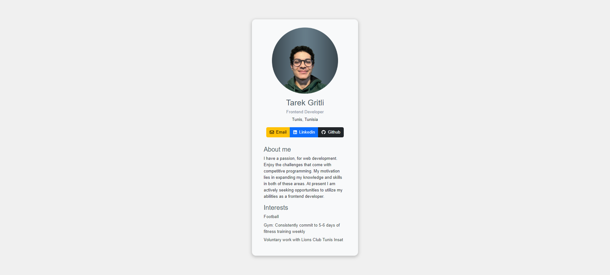

# Professional Business Card App

This is a professional digital business card built using React.

## Features

- Display personal information such as name, job title, location, and contact details.
- Showcase skills and interests.
- Includes buttons for contacting the user via email, LinkedIn, and GitHub.

## Screenshot




## Installation

To run this app locally, follow these steps:

1. Clone the repository:

   ```bash
   git clone https://github.com/tarek-gritli/digital-business-card.git
2. Navigate to the project directory:

   ```bash
   cd digital-business-card
3. Install dependencies:
   ```bash
   npm install
4. Start the server:
   ```bash
   npm run dev
5. Open your browser and navigate to  `http://localhost:5173`

##  Usage

- Fill in your personal information in the Info component.
- Customize the About and Interests components to showcase your skills and interests.
- Modify the styles in the CSS file (App.css) to match your preferences.

## Contact

For any inquiries or feedback, feel free to contact me, the author